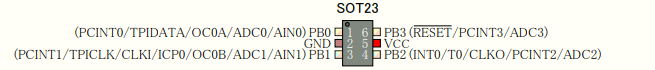
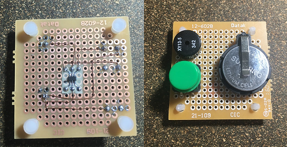

MelodyMenuet_Attiny10
====
A program to play Melody Menuet on Attiny10.

## Description

A program to play Melody Menuet on Attiny10.  
(Atmel Studio 7.0 project files)

This project files are importing Atmel Stduio Project From [bitDuino by maris-HY][bitDuino],  
then functions `toneCycle()` and `delay()` based on bitDuino can be used  
on Atmel Studio 7.0.

Original:  
[ToneSmapleSketch][] of [bitDuino by maris-HY][bitDuino]  

## Demo Circuit



```
  Attiny10
  1. PB0   -- NC
  2. GND   -- GND
  3. PB1   -- NC
  4. PB2   -- SPK -- GND
  5. VCC   -- 3V-5V DC
  6. RESET -- SW  -- GND
```



## Requirement

* Attiny10
* Piezoelectric speaker (SPK)
* Momentary switch (SW)
* 3V-5V DC
* TPI Writer ( ex. AVRISP mkII )

## Usage

Attiny10 powered on, start to play melody from Speaker.  
When playing melody is done, Attiny10 go to SLEEP_MODE_PWR_DOWN.  
If Reset SW is pushed, Attiny10 will restart.  

Attiny10 Fuse is Factory setting.

## Licence

* **[ArduinoCore-avr][]**  
  by [arduino.cc][]  
  LGPL v2.1  
* **[bitDuino][]**  
  by [maris-HY][]  
* **[MelodyMenuet_Attiny10][]**  
  by [rimksky][]  
  CreativeCommon BY 4.0 / Adapted.  

## Author

  [rimksky][]  


[rimksky]: https://github.com/rimksky "rimksky"
[MelodyMenuet_Attiny10]: https://github.com/rimksky/MelodyMenuet_Attiny10 "MelodyMenuet_Attiny10"
[maris-HY]: https://github.com/maris-HY "maris-HY"
[bitDuino]: https://github.com/maris-HY/bitDuino "bitDuino by maris-HY"
[ToneSmapleSketch]: http://100year.cocolog-nifty.com/blog/2014/09/bitduino-21ab.html "ToneSmapleSketch"
[arduino.cc]: http://www.arduino.cc/ "Arduino"
[ArduinoCore-avr]: https://github.com/arduino/ArduinoCore-avr "ArduinoCore-avr"
